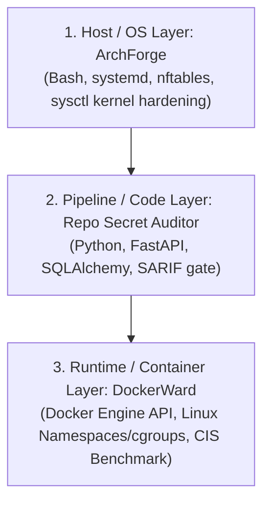
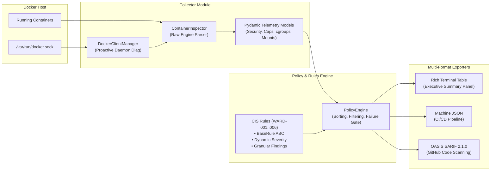

# DockerWard 🛡️

> **Runtime Security Audit & Posture Inspection Tool for Docker Containers**  
> Audits live Docker daemons and inspecting active containers against the CIS Docker Benchmark v1.6.0.

[](https://www.python.org/)
[](https://opensource.org/licenses/MIT)
[](https://docs.github.com/en/code-security/code-scanning/integrating-with-code-scanning/sarif-support-for-code-scanning)
[](https://www.cisecurity.org/benchmark/docker)
[-success.svg)](tests/)
[-success.svg)](tests/)

---

## 1. The Three-Layer Infrastructure Security Narrative

DockerWard is the third installment in a cohesive, production-grade infrastructure security portfolio:



1. **Host / OS Hardening:** [ArchForge](https://github.com/h3n-x/ArchForge) — Automated Linux system hardening, network namespace isolation, firewalling (`nftables`), and zero-trust OS configuration.
2. **Code & CI/CD Pipeline:** [Repo Secret Auditor](https://github.com/h3n-x/repo-secret-auditor) — High-throughput AST and entropy-based secret scanning with SARIF v2.1.0 reporting for PR gates.
3. **Container Runtime Security:** **DockerWard** (Current) — Live Docker Engine introspection, verifying process isolation, capability bounding sets, and cgroup enforcement directly against the Linux kernel.

---

## 2. The Problem: The Runtime Blind Spot

Static vulnerability scanners (such as Trivy, Grype, or Clair) inspect container filesystem images at build time. They detect vulnerable packages (`CVE-XXXX-YYYY`) inside the root filesystem. 

**However, static scanners are completely blind to how a container is executed at runtime:**

| Risk Vector | Static Image Scanner (Build Time) | DockerWard (Runtime) |
|---|:---:|:---:|
| Outdated `openssl` library in Debian image | ✅ Detected | ℹ️ Out of scope (build-time) |
| Container spawned with `--privileged` | ❌ **Blind** (defined at `docker run`) | ✅ **Detected (CRITICAL)** |
| Docker daemon socket bind-mounted (`/var/run/docker.sock`) | ❌ **Blind** (defined at runtime) | ✅ **Detected (CRITICAL/HIGH)** |
| No memory/CPU constraints (`cgroups` omitted) | ❌ **Blind** | ✅ **Detected (MEDIUM)** |
| Dangerous kernel capabilities added (`--cap-add=SYS_ADMIN`) | ❌ **Blind** | ✅ **Detected (HIGH)** |
| Seccomp syscall filter disabled (`--security-opt seccomp=unconfined`) | ❌ **Blind** | ✅ **Detected (HIGH)** |

A 100% CVE-free image becomes an open door to the host operating system if executed with misconfigured runtime flags. DockerWard closes this critical visibility gap.

---

## 3. Architecture & Design

DockerWard is architected with strict separation of concerns, high-performance typed models via **Pydantic v2**, and pluggable policy evaluation:



### Key Engineering Decisions:
- **Zero Shell Invocation:** Communicates directly with the Docker Engine API over Unix domain sockets using `docker-py`, avoiding fragile CLI parsing or subshell vulnerabilities.
- **Fail-Safe Policy Evaluation:** Each rule evaluates inside isolated exception boundaries; an edge case in one rule will never crash the audit of remaining checks.
- **Granular Finding Design:** Resource constraints and capability violations emit distinct sub-rule IDs (`WARD-004A/B/C`, `WARD-005A/B`) with specific remediation commands rather than vague compound alerts.

---

## 4. Linux Kernel Internals: Deep Dive

*This section explains the core Linux kernel isolation mechanisms evaluated by DockerWard, formatted for quick conceptual retention during technical interviews.*

### WARD-001: Root User (UID 0) & User Namespaces
- **The Concept:** Containers do not run on a hypervisor; they share the host Linux kernel.
- **Kernel Mechanism:** By default, Docker does not map user namespaces (`CONFIG_USER_NS`). Consequently, UID `0` inside the container is identical to UID `0` (root) on the host kernel process table.
- **The Risk:** Any kernel vulnerability, container escape, or mounted writeable host directory immediately grants the attacker full root privileges on the underlying host OS.

### WARD-002: Privileged Mode (`--privileged`)
- **The Concept:** The "master key" flag that strips away all container isolation.
- **Kernel Mechanism:** Executing with `--privileged` disables the device cgroup controller (`devices.allow = a *:* rwm`), allowing raw access to all host hardware devices (including `/dev/sda`), and grants all ~41 Linux kernel capabilities to the container.
- **The Risk:** An attacker can trivially mount the host root drive (`mount /dev/sda1 /mnt`) or write directly to kernel memory, achieving instantaneous host takeover.

### WARD-003: Docker Socket Mount (`/var/run/docker.sock`)
- **The Concept:** Exposing the Docker Engine API control plane into userland workloads.
- **Kernel Mechanism:** The Docker socket is a Unix domain stream socket owned by `root:docker`. 
- **The Risk:** 
  - **Read-Write (`rw`):** Grants arbitrary API execution. An attacker can instruct the daemon to launch a new helper container mounting the entire host filesystem (`-v /:/host --privileged`).
  - **Read-Only (`ro`):** Allows querying `GET /containers/{id}/json`, leaking private environment variables, database credentials, and auth tokens from every other container running on that host.

### WARD-004: Resource Constraints & cgroups v1/v2
- **The Concept:** Control Groups (`cgroups`) are the resource metering and throttling mechanism of the Linux kernel.
- **Kernel Mechanism:**
  - **Memory (`memory.max`):** Without a ceiling, a memory leak exhausts host RAM and swap space, forcing the kernel Out-Of-Memory (`OOM`) killer to terminate critical system daemons.
  - **CPU (`cpu.max` / CFS Bandwidth):** Without Completely Fair Scheduler (CFS) quotas, a runaway compute loop starves host CPU cores and spikes system latency.
  - **PIDs (`pids.max`):** Without a process count ceiling, a simple 3-line fork bomb (`:(){ :|:& };:`) consumes all slots in the host kernel's PID table (`/proc/sys/kernel/pid_max`), completely freezing the host OS.

### WARD-005: Linux Kernel Capabilities & Bounding Sets
- **The Concept:** Linux breaks the monolithic power of `root` into ~41 distinct privileges called capabilities.
- **Kernel Mechanism:** Docker retains ~14 default capabilities in the container's Bounding Set. Adding dangerous capabilities like `CAP_SYS_ADMIN` (file system mounts, cgroup configuration) or `CAP_NET_ADMIN` (raw routing table and firewall manipulation) effectively neutralizes security boundaries.
- **The Fix:** The CIS Docker Benchmark dictates applying the principle of least privilege: drop all capabilities (`--cap-drop=ALL`) and selectively re-add only the exact subset required (`--cap-add=CHOWN`).

### WARD-006: Seccomp & Berkeley Packet Filter (BPF) Syscall Throttling
- **The Concept:** Secure Computing Mode (`seccomp-bpf`) is a programmable system call firewall in the Linux kernel.
- **Kernel Mechanism:** The Linux kernel exposes ~330+ system calls. Docker's default seccomp profile whitelists safe syscalls and blocks ~44 high-risk calls (such as `reboot`, `keyctl`, `process_vm_readv`, `acct`).
- **The Risk:** Setting `seccomp=unconfined` disables the BPF filter entirely, exposing the full attack surface of kernel system calls to potential exploits.

---

## 5. CIS Docker Benchmark Rule Catalog

| Rule ID | CIS Benchmark | Title | Severity | Core Risk |
|---|---|---|:---:|---|
| **`WARD-001`** | CIS 4.1 | Container running as root (UID 0) | **HIGH** | UID 0 shared with host kernel in unmapped user namespace. |
| **`WARD-002`** | CIS 5.4 | Container running in privileged mode | **CRITICAL** | Device cgroup lifted; all capabilities granted. Trivial escape. |
| **`WARD-003`** | CIS 5.31 | Docker socket mounted in container | **CRITICAL / HIGH** | RW allows daemon command execution; RO leaks sibling secrets. |
| **`WARD-004A`** | CIS 5.10 | Missing memory resource constraint | **MEDIUM** | Unbounded memory consumption triggers host kernel OOM killer. |
| **`WARD-004B`** | CIS 5.11 | Missing CPU bandwidth constraint | **MEDIUM** | Uncapped CFS CPU quota starves neighboring workloads. |
| **`WARD-004C`** | CIS 5.28 | Missing PIDs limit constraint | **MEDIUM** | Unconstrained process table risks host-wide fork-bomb denial of service. |
| **`WARD-005A`** | CIS 5.3 | Dangerous capabilities granted | **HIGH** | High-privilege capabilities (`SYS_ADMIN`, `NET_ADMIN`) granted. |
| **`WARD-005B`** | CIS 5.3 | Baseline capabilities not dropped | **LOW** | Failure to adhere to least-privilege baseline (`--cap-drop=ALL`). |
| **`WARD-006`** | CIS 5.21 | Default seccomp profile disabled | **HIGH** | `seccomp:unconfined` unblocks 300+ raw kernel system calls. |

---

## 6. Hands-On Testbed & Verification

DockerWard includes a reproducible security testbed (`docker-compose.test.yml`) simulating 3 distinct operational security postures:

```bash
# 1. Spin up the 3 testbed containers
docker compose -f docker-compose.test.yml up -d

# Check running containers
docker ps --format "table {{.Names}}\t{{.Status}}\t{{.Image}}"
```

### The 3 Archetypes:
1. **`ward-victim-privileged` (CRITICAL):** Root user, `--privileged`, read-write Docker socket mounted, unconfined seccomp, no resource limits.
2. **`ward-victim-exposed` (HIGH):** Root user, `CAP_SYS_ADMIN` and `CAP_NET_ADMIN` added, no resource limits.
3. **`ward-victim-hardened` (SAFE CONTROL):** Non-root UID `1000:1000`, read-only root filesystem, `--cap-drop=ALL`, `no-new-privileges:true`, bounded memory (`128m`), CPU (`0.5`), and PIDs (`50`).

---

## 7. CLI Usage Reference

### Installation
```bash
# Clone repository
git clone https://github.com/h3n-x/DockerWard.git
cd DockerWard

# Create virtual environment & install in editable mode
python3 -m venv .venv
source .venv/bin/activate
pip install -e .
```

### Commands

#### 1. Connectivity Check
```bash
dockerward ping
```

#### 2. Deep Container Telemetry Inspection
```bash
# Inspect all running containers
dockerward inspect

# Inspect single container
dockerward inspect ward-victim-hardened

# Raw JSON telemetry output
dockerward inspect ward-victim-privileged --json
```

#### 3. Security Audit (Terminal Table Output)
```bash
# Full runtime audit
dockerward audit

# Audit single container
dockerward audit ward-victim-privileged
```

*Example Terminal Audit Output:*
```
       Security Audit: ward-victim-privileged (86929020fc49) — 8 Finding(s)       
┏━━━━━━━━━━━━━┳━━━━━━━━━━━━━━┳━━━━━━━━━━━━━━━━━━━━━━━━┳━━━━━━━━━━━━━━━━━━━━┳━━━━━━━━━━━┓
┃ Rule ID     ┃   Severity   ┃ CIS Benchmark          ┃ Finding & Desc     ┃ Remediat… ┃
┡━━━━━━━━━━━━━╇━━━━━━━━━━━━━━╇━━━━━━━━━━━━━━━━━━━━━━━━╇━━━━━━━━━━━━━━━━━━━━╇━━━━━━━━━━━┩
│ WARD-002    │   CRITICAL   │ CIS Docker 1.6.0 - 5.4 │ Privileged mode    │ Remove    │
│ WARD-003    │   CRITICAL   │ CIS Docker 1.6.0 - 5.31│ Docker socket (RW) │ Remove    │
│ WARD-001    │     HIGH     │ CIS Docker 1.6.0 - 4.1 │ Running as root    │ USER 1000 │
│ WARD-006    │     HIGH     │ CIS Docker 1.6.0 - 5.21│ Seccomp unconfined │ Remove    │
│ WARD-004A   │    MEDIUM    │ CIS Docker 1.6.0 - 5.10│ No memory limit    │ --memory  │
│ WARD-004B   │    MEDIUM    │ CIS Docker 1.6.0 - 5.11│ No CPU limit       │ --cpus    │
│ WARD-004C   │    MEDIUM    │ CIS Docker 1.6.0 - 5.28│ No PIDs limit      │ --pids-l… │
│ WARD-005B   │     LOW      │ CIS Docker 1.6.0 - 5.3 │ Missing cap-drop   │ --cap-dr… │
└─────────────┴──────────────┴────────────────────────┴────────────────────┴───────────┘

✓ ward-victim-hardened (cec3debbc93f): Conforms to audited security benchmarks.

╭─ DockerWard Executive Security Summary ─╮
│ Scanned Containers                   3  │
│ Total Findings                      14  │
│   CRITICAL                           2  │
│   HIGH                               4  │
│   MEDIUM                             6  │
│   LOW                                2  │
╰─────────────────────────────────────────╯
```

#### 4. SARIF 2.1.0 Export (GitHub Code Scanning Integration)
```bash
# Output SARIF to stdout
dockerward audit --format sarif

# Save SARIF to file for CI upload
dockerward audit --format sarif -o results.sarif
```

#### 5. Machine-Readable JSON Export
```bash
dockerward audit --format json -o audit-report.json
```

#### 6. CI/CD Failure Gates
```bash
# Fail pipeline with exit code 1 if any CRITICAL or HIGH vulnerabilities are detected:
dockerward audit --fail-on HIGH
```

---

## 8. GitHub Actions CI/CD Integration

You can integrate DockerWard into any GitHub workflow to automatically scan runtime containers and publish results to the **GitHub Security → Code Scanning alerts** tab using the official SARIF upload action.

Create `.github/workflows/dockerward-audit.yml`:

```yaml
name: DockerWard Runtime Security Audit

on:
  push:
    branches: [ main ]
  pull_request:
    branches: [ main ]
  workflow_dispatch:

jobs:
  runtime-audit:
    name: Audit Container Security Posture
    runs-on: ubuntu-latest
    permissions:
      security-events: write
      actions: read
      contents: read

    steps:
      - name: Checkout Code
        uses: actions/checkout@v4

      - name: Set up Python 3.12
        uses: actions/setup-python@v5
        with:
          python-version: "3.12"
          cache: "pip"

      - name: Install DockerWard
        run: |
          pip install --upgrade pip
          pip install .

      - name: Start Target Containers
        run: |
          # Start workload containers to audit
          docker compose -f docker-compose.test.yml up -d

      - name: Run DockerWard Audit & Generate SARIF
        run: |
          dockerward audit --format sarif -o results.sarif

      - name: Upload SARIF to GitHub Code Scanning
        uses: github/codeql-action/upload-sarif@v3
        if: always()
        with:
          sarif_file: results.sarif
          category: dockerward-runtime-audit

      - name: Enforce Security Quality Gate
        run: |
          # Block build if CRITICAL or HIGH misconfigurations exist
          dockerward audit --fail-on HIGH
```

---

## 9. Automated Testing & Code Quality

The test suite thoroughly validates every security rule across both violation and compliant cases, mock container parsers, and the SARIF 2.1.0 exporter:

```bash
# Run full test suite with coverage report
.venv/bin/pytest --cov=dockerward --cov-report=term-missing
```

```
============================== test session starts ==============================
collected 71 items

tests/test_cli.py ...............                                        [ 21%]
tests/test_collector.py ..................                               [ 46%]
tests/test_rules.py ..................................                   [ 94%]
tests/test_sarif.py ....                                                 [100%]

================================ tests coverage ================================
Name                                              Stmts   Miss  Cover   Missing
-------------------------------------------------------------------------------
dockerward/__init__.py                                1      0   100%
dockerward/cli.py                                   195     14    93%
dockerward/collector/__init__.py                      4      0   100%
dockerward/collector/client.py                       40     25    38%
dockerward/collector/inspector.py                    74     19    74%
dockerward/collector/models.py                       95      0   100%
dockerward/reporting/__init__.py                      2      0   100%
dockerward/reporting/sarif.py                        40      0   100%
dockerward/rules/__init__.py                          5      0   100%
dockerward/rules/base.py                              6      0   100%
dockerward/rules/definitions/__init__.py              8      0   100%
dockerward/rules/definitions/capabilities.py         27      0   100%
dockerward/rules/definitions/docker_socket.py        25      0   100%
dockerward/rules/definitions/privileged_mode.py      13      0   100%
dockerward/rules/definitions/resource_limits.py      19      0   100%
dockerward/rules/definitions/root_user.py            14      0   100%
dockerward/rules/definitions/seccomp.py              13      0   100%
dockerward/rules/engine.py                           39      0   100%
dockerward/rules/models.py                           19      0   100%
-------------------------------------------------------------------------------
TOTAL                                               639     58    91%
============================== 71 passed in 1.05s ==============================
```

---

## 10. License

This project is licensed under the MIT License — see the [LICENSE](LICENSE) file for details.
